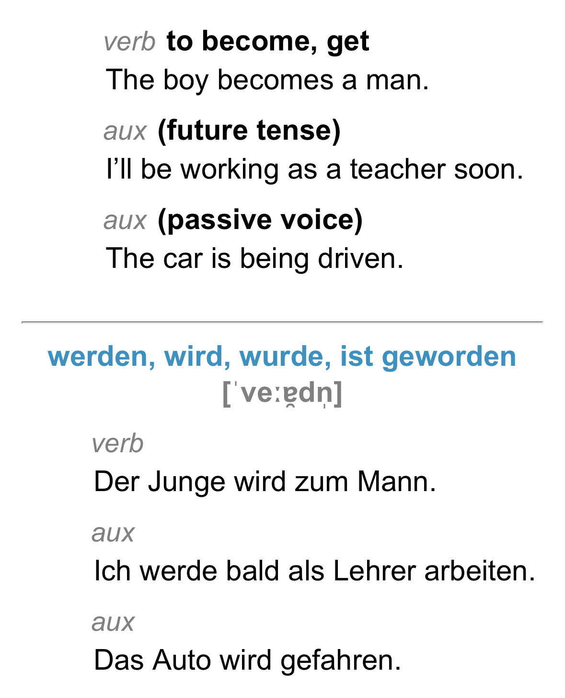

# English-Deutsch (Sorted by Frequency)

[A Frequency Dictionary of German](https://ankiweb.net/shared/info/912352287), extended to include [plural forms](https://en.wiktionary.org/wiki/Appendix:German_plurals) of nouns, [principal parts](https://en.wikipedia.org/wiki/Principal_parts) of verbs, and [IPA transcriptions](https://en.wikipedia.org/wiki/Help:IPA/Standard_German) for pronunciation.

> A Frequency Dictionary of German contains the 5,000 most commonly used words of German today, occurring in a 20-million-word corpus ... and [representing] different genres, text types, registers, styles, and also regional varieties. ([Source](https://www.amazon.com/Frequency-Dictionary-German-Vocabulary-Dictionaries/dp/1138659789))



## Installation
1. Build Python Environment
```
$ python -m venv .venv
$ source .venv/bin/activate
$ python -m pip install poetry
$ poetry install
```
2. Download Original Anki Deck

**Disclaimer**: I only provide a Python script to extract linguistic resources from Wiktionary. If you want to use this Anki deck, please buy the original book ([Amazon](https://www.amazon.com/Frequency-Dictionary-German-Vocabulary-Dictionaries/dp/1138659789)). I did not create the deck linked below, nor do I claim ownership of this deck or the book from which it was created.
> https://ankiweb.net/shared/info/912352287
3. Export Anki Deck as Text File
> File → Export → Notes in Plain Text (.txt)
4. Download Latest Wiktionary Dump
> https://dumps.wikimedia.org/dewiktionary/latest/
5. Run Python Script
```
$ python main.py --input-deck FILE_PATH --output-deck FILE_PATH [--exceptions FILE_PATH]
```
